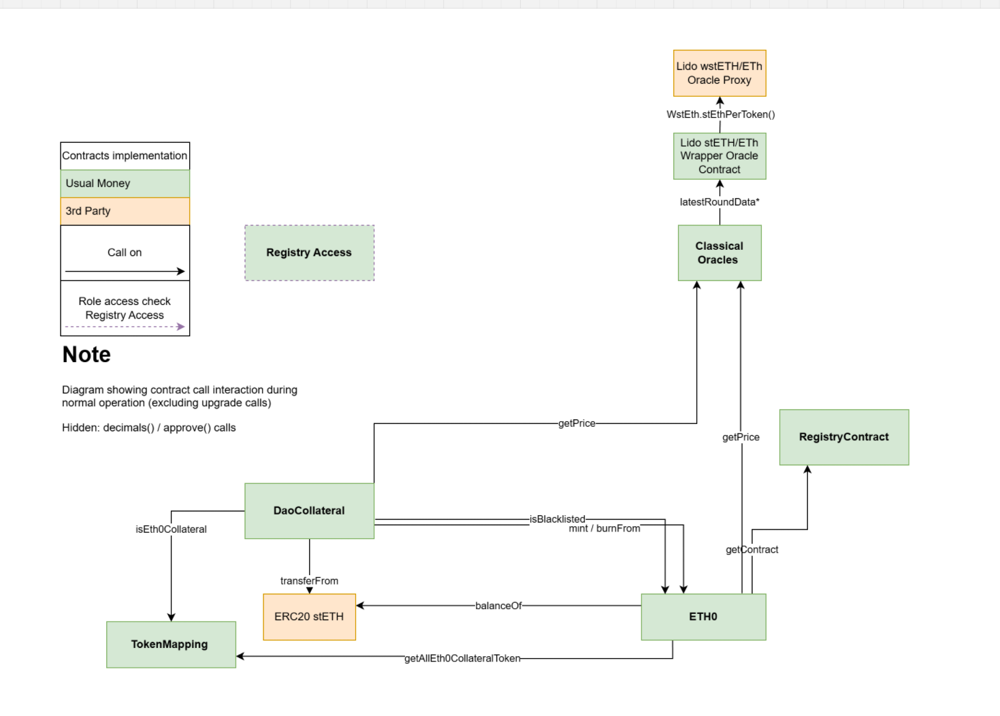

# ETH0

This is a Foundry project which contains the smart contracts that power the Usual Eth0 protocol.

### Ethereum architecture


## Documentation

To automatically generate documentation from the NatSpec comments run:

```sh
forge doc
```

To serve the book locally for easy viewing in a browser, run:

```sh
forge doc --serve --port 4000
```

### Technical documentation

 - [Technical documentation](https://tech.usual.money/)

## Dependencies

- [Node.js](https://nodejs.org/en/)
- [Yarn](https://yarnpkg.com/getting-started/install)
- [Python](https://www.python.org/downloads/)
- [Foundry](https://book.getfoundry.sh/getting-started/installation)

These are optionals:

- [Make](https://www.gnu.org/software/make/manual/make.html)
- [Docker](https://docs.docker.com/get-docker/)

## Dockerfile

You can build the CLI's Docker image by running `make deps`, and then use `make exec` to enter a container of this image.

## Scripts

- `yarn install` - Install dependencies
- `yarn install-slither` - Install slither in a virtual environment
- `yarn build` - Compile contracts
- `yarn test` - Run tests
- `yarn coverage` - Run tests with coverage
- `yarn lint` - Run linter
- `yarn lint:check` - Check if there are any linting issues
- `yarn format` - Run formatter
- `yarn format:check` - Check if there are any formating issues
- `yarn analyze` - Run the static analyzer (slither)
- `yarn deploy:local` - Start an Anvil fork and deploy the contracts locally
- `yarn seed:local` - Run the seed scripts to generate activity on the smart contracts

## Precommit

Runs lint and format on precommit.

## Seeding

Data seeding corresponds here to the act of funding accounts with tokens (wstETH, ETH0) and contracts with liquidity.
It should only be done on Anvil forks for debugging & manual testing purposes.

You should import the mnemonic provided as environment variable into your wallet of choice.
If wish to keep your own mnemonic, you can manually derive the private keys and import them one by one.

Alice refers to the first private key derived from that mnemonic, and Bob to the second one.
See `./scripts/deployment/Base.s.sol` for the index of additional accounts, such as the Usual DAO or Treasury.
`yarn deploy:local` will automatically fund Alice's account with ETH and wstETH.

If you need additional data, run yarn seed:local, which will:

Deposit initial liquidity for ETH collateral
Perform a few swaps to create activity
Deposit collateral (wstETH) in the DaoCollateral contract
Perform a few swaps (direct mints) of wstETH for ETH0
Fund Alice's account with ETH0

## Deployment

In order to deploy the contract you will need to have a `.env` file.
Just copy the `.env.sample` as `.env` in your project and modify the values.

Run the following script:

```sh
# Run your anvil node on a separate terminal
yarn start:anvil
# It gets the private keys from the .env file seed named `MNEMONIC` and will use address at index `MNEMONIC_INDEX` as deployer address

# Run the deployment script simulation
yarn deploy:simulate

# Run the deployment locally on the anvil node
yarn deploy:local
```

You can also run any individual script with the following command:

```sh
yarn deploy {SCRIPT_CONTRACT_NAME} --rpcUrl {RPC_URL} --etherscanApiKey {ETHERSCAN_API} --broadcast --network {NETWORK_NAME}
```

`ETHERSCAN_API_KEY` is optional and will be used only if you want to verify the contract on Etherscan.
`broadcast` flag is optional and will be used only if you want to broadcast the transaction to the network.
`RPC_URL` is optional and will be used only if you want to fork from a specific network different from the one specified in the `.env` file.

# Upgrading contracts

The upgrade process is a bit more complex than the deployment process, as it requires a new contracts to be deployed and the old contracts to be replaced with the new one.
We are using the transparent proxy pattern, which allows us to upgrade the contract logic without changing the contract address in a safe way (e.g: it's harder to nuke contract upgradability).

## Storage

If the storage needs the addition of new fields, a new structure should be added to the contract being upgraded using the [ERC7201 namespaced storage layout](https://eips.ethereum.org/EIPS/eip-7201) with its accompanying getter function.

### Add the new structure

```solidity
   struct DaoCollateralStorageV0 {
        ...
    }

   struct DaoCollateralStorageV1 {
        /// @notice The STBC address of the reward token.
        IERC20 rewardToken;
    }
```

The structure contains the additional fields that are needed to be added to the storage.

### Add the new storage getter

Following the ERC7201 a bytes32 constant storage location pointer must be added to the protocol, currently the constant is defined as part of the contract, to generate the new constant [`chisel`](https://book.getfoundry.sh/chisel/) (or Remix) can be used to compute its value, see below an example of how to compute the new storage location based on the unique string `daoCollateral.storage.v1`:

```sh
%> chisel
Welcome to Chisel! Type `!help` to show available commands.
➜ !traces
Enabled traces!
➜ keccak256(abi.encode(uint256(keccak256("daoCollateral.storage.v1")) - 1)) & ~bytes32(uint256(0xff))
Type: uint256
├ Hex: 0xa0dbd9bf44a5ca216ab5c81c4a859860698e1bd082e2c40ac437d6a4b9eb7200
├ Hex (full word): 0xa0dbd9bf44a5ca216ab5c81c4a859860698e1bd082e2c40ac437d6a4b9eb7200
└ Decimal: 72758498116045592993721891598353994991734257388149949036340913001930951455232
```

The storage getter shall be `internal` so that storage is accessible through heritage, and it should be defined as follows:

```solidity
    // keccak256(abi.encode(uint256(keccak256("daoCollateral.storage.v0")) - 1)) & ~bytes32(uint256(0xff))
    // solhint-disable-next-line
    bytes32 public constant DaoCollateralStorageV0Location =
        0xb6b5806749b83e5a37ff64f3aa7a7ce3ac6e8a80a998e853c1d3efe545237c00;

    function _daoCollateralStorageV0() internal pure returns (DaoCollateralStorageV0 storage $) {
        bytes32 position = DaoCollateralStorageV0Location;
        assembly {
            $.slot := position
        }
    }
```

## Update the contract

Updates shall be atomic and should be done in a single transaction, either through a single contract or a batched Gnosis Safe Transaction.
Alternative methods are available such as pausing and unpausing the contract, but this is not recommended as it may lead to complexity in execution.

## Write the deployment script

Write a deployment script that submit the implementations contracts on the blockchain.
Use the Safe environment to create the upgrade transaction in batch (IMPORTANT) with the desired parameters (e.g: initialization function if any and parameters).

## Do the deployment and upgrade

Submit the batch of transaction to roll out the upgrade, have the development team ready to rollback in case of failure.

# Tenderly Testnet deployment

1. create a virtual tesnet with sync activated
2. fund deployer account and alice (0x411FAB2b2A2811Fa7DeE401F8822De1782561804) account
3. run deployment mainnet upgrade script (i.e forge clean && forge script scripts/deployment/Mainnet.s.sol:P3 -f https://virtual.mainnet.rpc.tenderly.co/e226ade4-61c1-4dd3-ab39-61b6e1f1c4ec --private-key 4242424224242424242)
4. fund and allowlist testers addresses . you need to run it with the admin rpc

```
forge clean && forge script  scripts/deployment/TenderlyTestnetSetup.s.sol -f https://virtual.mainnet.rpc.tenderly.co/ADMIN --unlocked --broadcast
```
